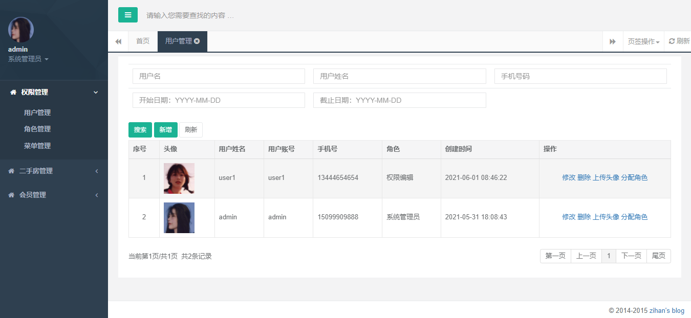
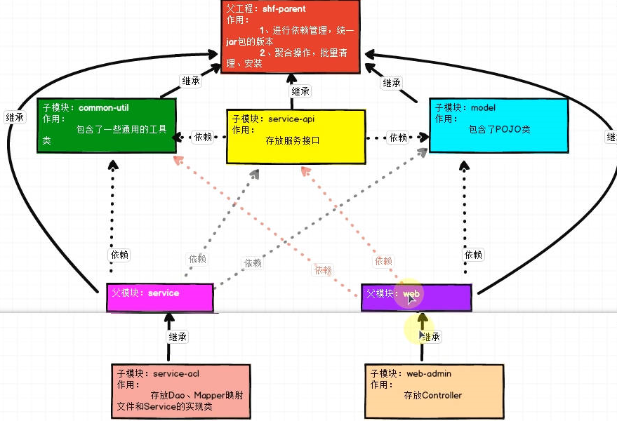
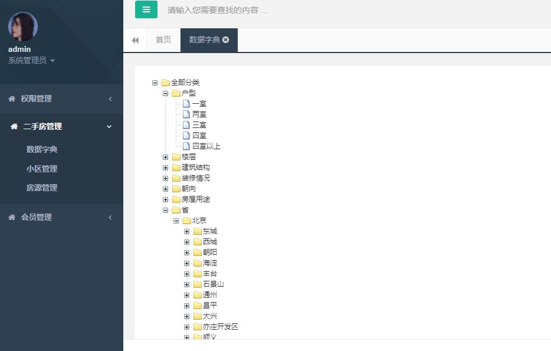
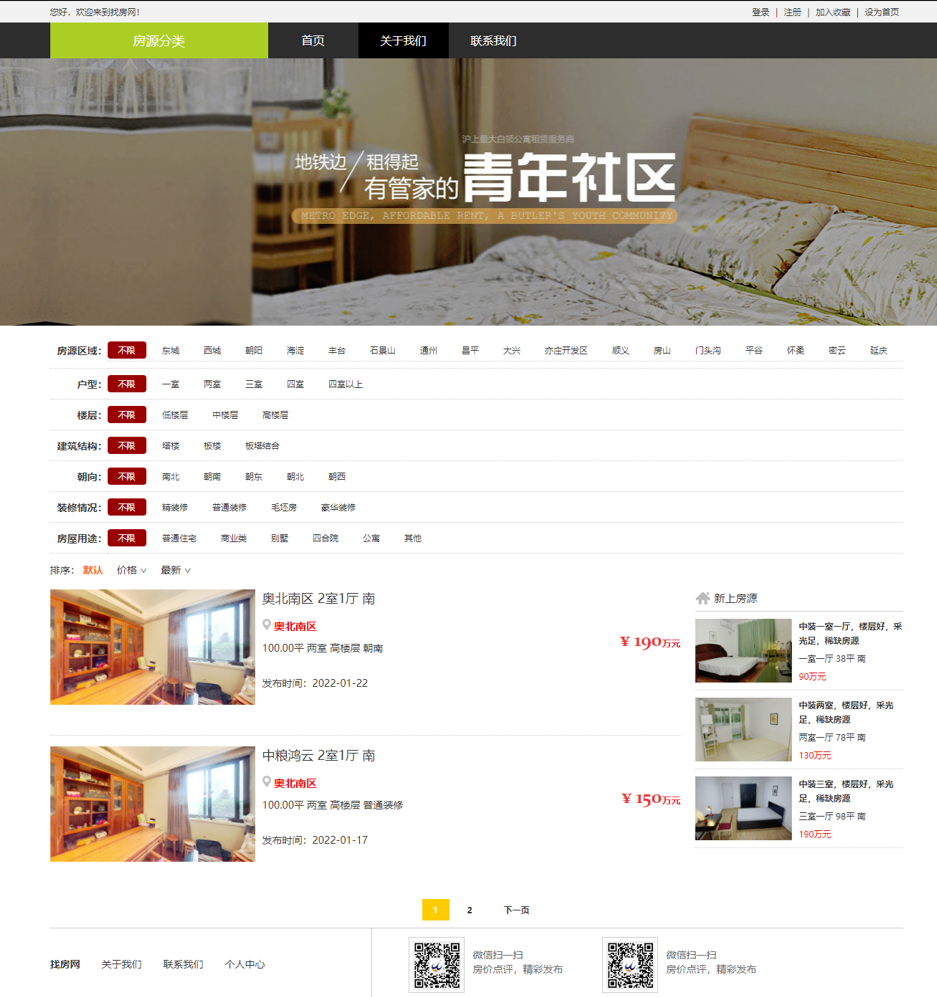

# 尚好房项目

### 1、介绍

此项目是一个二手房管理服务平台，适合作为SSM阶段练手的一个项目。

### 2、核心技术

| 基础框架：ssm                                           |
| ------------------------------------------------------- |
| 分布式框架：ssm + Dubbo + zookeeper                     |
| spring session redis 实现session共享（redis目前未实现） |
| 图片服务器：七牛云                                      |
| 后台管理权限控制：spring-security                       |
| 前端用户登录判断：拦截器                                |
| 后台管理模板：Thymeleaf                                 |
| 前端技术:Vue+Axios                                      |

### 3、项目模块

```
  
├─common-util
│  └─src
│      ├─main
│      │  ├─java
│      │  │  └─com
│      │  │      └─ikun
│      │  │          ├─controller
│      │  │          │      BaseController.java 
│      │  │          ├─mapper
│      │  │          │      BaseMapper.java
│      │  │          ├─result
│      │  │          │      Result.java
│      │  │          │      ResultCodeEnum.java
│      │  │          ├─service
│      │  │          │  │  BaseService.java
│      │  │          │  └─Impl
│      │  │          │          BaseServiceImpl.java    
│      │  │          └─util      
├─model
│  └─src
│      ├─main
│      │  ├─java
│      │  │  └─com
│      │  │      └─ikun
│      │  │          ├─entity
│      │  │          │      Admin.java
│      │  │          │      AdminRole.java
│      │  │          │      ...
│      │  │          └─vo
│      │  │                  HouseQueryVo.java
│      │  │                  ...
│  
├─server-api
│  └─src
│      ├─main
│      │  ├─java
│      │  │  └─com
│      │  │      └─ikun
│      │  │          └─service
│      │  │                  AdminService.java
│      │  │                  CommunityService.java
│      │  │                  ...
├─service  
│  ├─service-acl
│  │  │  pom.xml
│  │  │  
│  │  └─src
│  │      ├─main
│  │      │  ├─java
│  │      │  │  └─com
│  │      │  │      └─ikun
│  │      │  │          ├─mapper
│  │      │  │          │      AdminMapper.java
│  │      │  │          │      RoleMapper.java
│  │      │  │          │      
│  │      │  │          └─service
│  │      │  │              └─impl
│  │      │  │                      AdminServiceImpl.java
│  │      │  │                      RoleServiceImpl.java
│  │      │  │                      
│  │      │  ├─resources
│  │      │  │  │  db.properties
│  │      │  │  │  ...
│  │      │  │  │  
│  │      │  │  └─mapper
│  │      │  │          AdminMapper.xml
│  │      │  │          RoleMapper.xml
│  │      │  │          
│  │      │  └─webapp
│  │      │      └─WEB-INF
│  │      │              web.xml
│  ├─service-house
│  │  │  pom.xml
│  │  │  
│  │  └─src
│  │      ├─main
│  │      │  ├─java
│  │      │  │  └─com
│  │      │  │      └─ikun
│  │      │  │          ├─mapper
│  │      │  │          │      CommunityMapper.java
│  │      │  │          │      ...
│  │      │  │          └─service
│  │      │  │              └─impl
│  │      │  │                      CommunityServiceImpl.java
│  │      │  │                      ...
│  │      │  ├─resources
│  │      │  │  │  db.properties
│  │      │  │  │  ...
│  │      │  │  └─mapper
│  │      │  │          CommunityMapper.xml
│  │      │  │          ...  
│  │      │  └─webapp
│  │      │      └─WEB-INF
│  │      │              web.xml
│  │      │              
│  └─service-user
│      │  pom.xml
│      │  
│      └─src
│          ├─main
│          │  ├─java
│          │  │  └─com
│          │  │      └─ikun
│          │  │          ├─mapper
│          │  │          │      UserFollowMapper.java
│          │  │          │      UserInfoMapper.java
│          │  │          │      
│          │  │          └─service
│          │  │              └─impl
│          │  │                      UserFollowServiceImpl.java
│          │  │                      UserInfoServiceImpl.java
│          │  │                      
│          │  ├─resources
│          │  │  │  db.properties
│          │  │  │  ...
│          │  │  └─mapper
│          │  │          UserFollowMapper.xml
│          │  │          UserInfoMapper.xml
│          │  │          
│          │  └─webapp
│          │      └─WEB-INF
│          │              web.xml
└─web
    ├─web-admin
    │  │  pom.xml
    │  │  
    │  └─src
    │      ├─main
    │      │  ├─java
    │      │  │  └─com
    │      │  │      └─ikun
    │      │  │          └─controller
    │      │  │                  AdminController.java
    │      │  │                  ...
    │      │  ├─resources
    │      │  │      logback.xml
    │      │  │      spring-registry.xml
    │      │  │      springmvc.xml
    │      │  │      
    │      │  └─webapp
    │      │      ├─static
    │      │      └─WEB-INF
    │      │          │  web.xml
    │      │          │  
    │      │          └─templates
    │      │              ├─admin   
    │      │              ├─...
    └─web-front
        │  pom.xml
        │  
        └─src
            ├─main
            │  ├─java
            │  │  └─com
            │  │      └─ikun
            │  │          ├─controller
            │  │          │      DictController.java
            │  │          │     ... 
            │  │          └─interceptor
            │  │                  LoginInterceptor.java
            │  │                  
            │  ├─resources
            │  │      logback.xml
            │  │      spring-registry.xml
            │  │      springmvc.xml
            │  │      
            │  └─webapp
            │      │ ...


```

### 4、完成的基础功能如下

#### 1️⃣后台管理模块



- 框架模板：Hplus

- 角色管理
  - 弹出层框架：layer（hplus-master已经引入了layer框架）
  - 查询、添加、修改、删除角色
  - 分页处理 ★★★
- 代码的封装
  - 常用的CRUD方法抽取出来封装成BaseMapper、BaseService、...
- 前端页面的数据校验：jQuery Validate 插件
- 用户管理
  - 用户管理的增删改查
- 项目服务的拆分：把单体架构拆分为dubbo通信的分布式架构
  - 
  - 3个dubbo服务**提供者**模块：权限服务、房源服务、会员服务
  - 2个服务**消费者**模块：尚好房管理平台（web-admin）、网站前端（web-front）
- 二手房管理
  - 数据字典
    - 
    - 实现方案：zTree渲染
  - 小区管理
    - 二级联动：区域与板块，区域与板块数据在数据字典里面，通过编码：beijing，可以获取区域数据
  - 房源管理
    - 房源管理的增删改查
    - 详情（房源信息、小区信息、房源图片、房产图片、经纪人信息、房东信息）
- 图片的上传
  - 图片存储方案--->七牛云
  - 房源图片上传
  - 用户头像上传

#### 2️⃣前端房源展示

首页：



- 前端页面渲染方式：Vue + Axios
- 搜索列表：
  - 房源区域为二级联动，区域与板块，数据字典数据
  - 户型、楼层等数据为数据字典一级数据
- 排序：
  - 默认排序：根据id
  - 价格排序：总价从高到低
  - 最新排序：创建时间（其实跟id排序大概一致）
- 房源列表：
  - 分页展示
- 房源详情页面的实现
- 发送验证码功能 ★
- 前端登录与注册、登出 ★★★
- 关注房源与取消关注
  - 登录拦截器的实现
  - 我的关注的实现

#### 3️⃣后台权限控制

- 待实现...